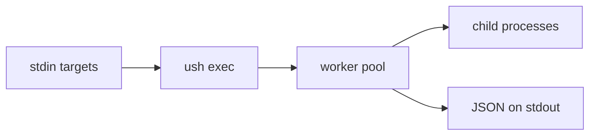
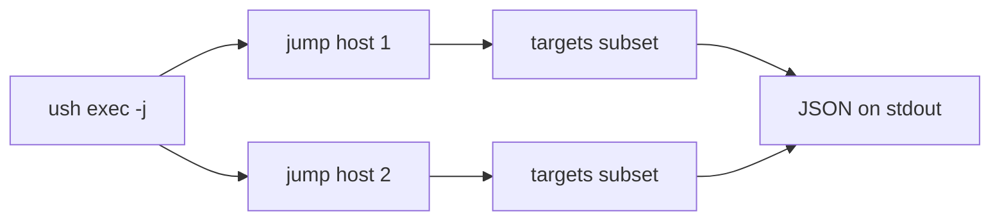

# Context

ush is a command-line tool and library for parallel execution of shell commands over a stream of targets.

## Domain terms

- target: one line read from stdin. Empty lines and lines starting with `#` are skipped. The string `{}` in the command template is replaced with the target.
- command template: the base command and arguments passed after `--`. Each occurrence of `{}` is replaced with the current target.
- worker: one thread that reads targets from the target channel, spawns the command template with the target substituted, and sends an `ExecResult` to the result channel.
- result channel: crossbeam channel that carries `ExecResult` values from workers to the writer thread.
- shutdown flag: atomic boolean set by the SIGINT/SIGTERM handler. Workers check it before starting a new target; a target already running is not interrupted.
- bounded capture: stdout/stderr collection limited to `stdout_bytes`/`stderr_bytes`. In tail mode the last N bytes are kept; in head mode the first N bytes are kept.
- process group: each child runs in its own process group so timeout handling can signal the whole group.
- jump host: an intermediate SSH host used to scale execution. ush opens one ssh-agent per jump host, runs ush on each host, and feeds it a subset of targets.
- ssh-agent slot: per-jump-host ssh-agent process and socket used to forward the jump key without a single shared agent becoming a bottleneck.
- freq aggregation: reading the JSON output of `ush exec` and grouping by stdout, stderr, exit status, or duration bucket.

## Data flow

## Jump host flow

