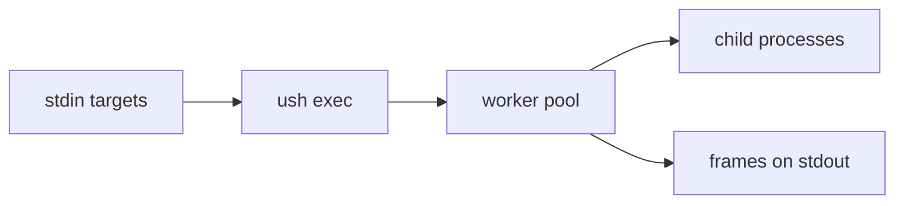
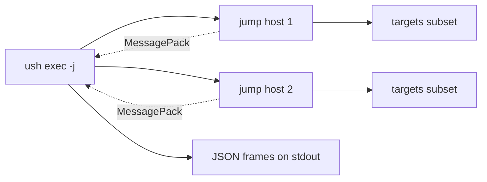

# ush

ush is a command-line tool and library for parallel execution of shell commands over a stream of targets. It reads targets from stdin, substitutes each target into `{}` placeholders in a command template, runs the commands in parallel, and emits streaming frames to stdout (JSON by default; MessagePack with `--format=msgpack`). Use `--batch` for the legacy one-line-per-target output.

## Usage

Run a command for each target:

```sh
echo -ne 'hello\nworld\n' | ush exec -- echo {}
```

Run via ssh over a list of hosts:

```sh
cat hosts.txt | ush exec -- ssh user@{} -- hostid
```

Run through jump hosts:

```sh
cat hosts.txt | ush exec -j jump_hosts.txt -k jump.key -- ssh user@{} -- hostid
```

Aggregate stdout across targets:

```sh
cat hosts.txt | ush exec -- ssh user@{} -- hostname | ush freq stdout
```

Aggregate exit status:

```sh
cat hosts.txt | ush exec -- ssh user@{} -- true | ush freq exitstatus
```

Show duration distribution in 1-second buckets:

```sh
cat hosts.txt | ush exec -- ssh user@{} -- sleep {} | ush freq duration 1s
```

## Commands

- `ush exec`: execute parallel commands from stdin.
- `ush freq`: aggregate exec JSON output by stdout, stderr, exit status, or duration.

See `ush --help` and `ush exec --help` for current flags.

## Data flow



## Jump hosts

When `-j` is given, ush starts one ssh-agent per jump host, runs ush on each host, and feeds a subset of targets to each. Results are forwarded back to the local result channel.


