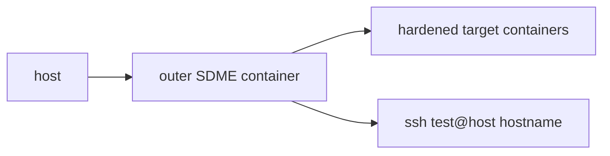
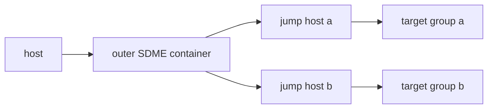

# SDME end-to-end tests

These tests run ush inside an outer SDME container. The outer container runs sdme itself, so the hardened target containers are nested. This exercises the real SSH path without depending on external hosts.

## Direct SSH test

`e2e-sdme.sh` builds an Ubuntu rootfs with openssh-server, starts N hardened nested containers with veth networking, and runs `ush exec --format=msgpack --batch` over SSH to collect hostnames. The MessagePack output is decoded and verified inside the outer container.



## Jump-host test

`e2e-sdme-jump.sh` starts two hardened jump containers and N hardened targets in each of two groups (a/b). The outer container runs `ush exec -j jumps -k key`; the inter-ush link on the jump hosts uses MessagePack framing. Two commands are exercised:

1. `uname` over the jump-host fan-out (MessagePack batch mode).
2. An 8 KiB blob per target streamed in 1 KiB chunks to verify chunked streaming.



## Running

Both default to N=10 and clean up on success.

```sh
./test/e2e-sdme.sh [N]
./test/e2e-sdme-jump.sh [N]
```

Set `KEEP=1` to leave containers running for inspection.

```sh
KEEP=1 ./test/e2e-sdme-jump.sh 5
```

## Requirements

- Linux host with sdme, systemd-nspawn, and btrfs storage for nested containers.
- Root privileges (sdme operations are rootful).
- jq, ssh-keygen, cargo on the host.
- python3-msgpack inside the outer container (installed by the orchestrator).
- Enough inotify instances for the nested containers; increase if boot fails:

```sh
sudo sysctl -w fs.inotify.max_user_instances=1024
```
